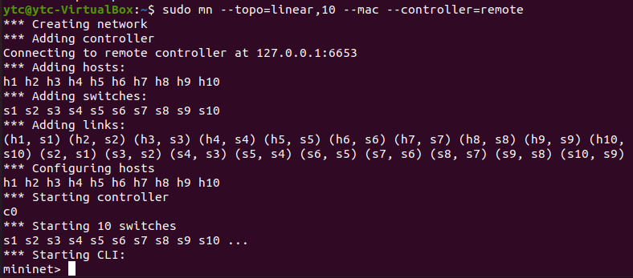
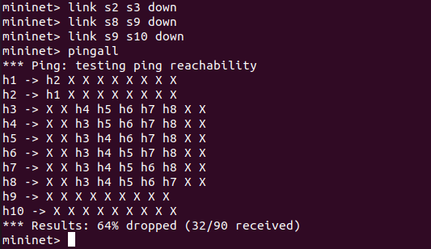
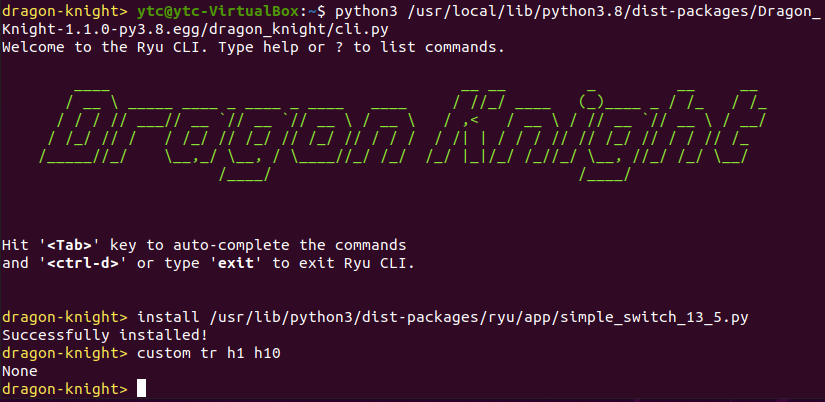
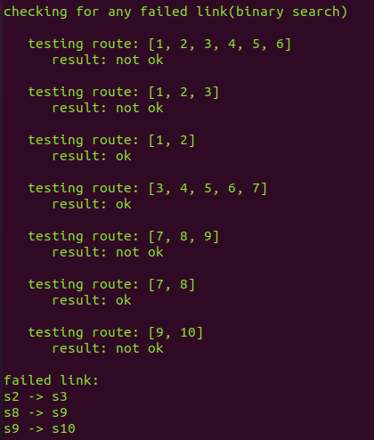
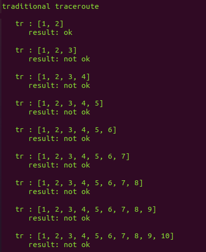

## SDN Traceroute
Ryu Controller Application with binary search traceroute functionality in Software-Defined Networking (SDN) with OpenFlow 1.3, implemented using Python, Ryu SDN Framework, Dragon Knight, and Mininet.

## Installation
Install [Ryu SDN Framework](https://ryu-sdn.org/), [Dragon Knight](https://github.com/Ryu-Dragon-Knight/Dragon-Knight), and [Mininet](http://mininet.org/).

Copy `simple_switch_13_5.py` to `/usr/lib/python3/dist-packages/ryu/app/`.

Copy `dk_plugin.py` and `rest.py` to `/usr/local/lib/python3.8/dist-packages/Dragon_Knight-1.1.0-py3.8.egg/dragon_knight/`.

## How to Run
Run Dragon Knight daemon (`dragon-knightd` or `daemon.py`).
```
$ python3 /usr/local/lib/python3.8/dist-packages/Dragon_Knight-1.1.0-py3.8.egg/dragon_knight/daemon.py
```

Run Dragon Knight CLI (`dragon-knight` or `cli.py`).
```
$ python3 /usr/local/lib/python3.8/dist-packages/Dragon_Knight-1.1.0-py3.8.egg/dragon_knight/cli.py
```

Install `simple_switch_13_5.py` in Dragon Knight CLI.
```
$ install /usr/lib/python3/dist-packages/ryu/app/simple_switch_13_5.py
```
Dragon Knight daemon will run controller application automatically after installation.

Run Mininet and create 10 switches in linear topology.
```
$ sudo mn --clean
$ sudo mn --topo=linear,10 --mac --controller=remote
```
Switches will connect to Ryu controller application automatically.

Disconnect links between switches in Mininet CLI.
```
$ link s2 s3 down
$ link s8 s9 down
$ link s9 s10 down
```

Test network reachability in Mininet CLI.
```
$ pingall
```

Run traceroute command in Dragon Knight CLI.
```
$ custom tr h1 h10
```
Dragon Knight daemon will show traceroute result of binary search as well as traditional TTL-based mechanism.

## Tested Environment
Ubuntu 20.04.1 LTS

Python 3.8.2

Ryu 4.34

Dragon Knight 1.1.0

Mininet 2.2.2

## Screenshots
### Run Mininet, disconnect links, and pingall.
<p>


</p>

### Run Dragon Knight CLI and traceroute command.



### Traceroute result of binary search and traditional TTL-based mechanism.
<p>


</p>

## Note
`rest.py` modified to resolve WebOb backward compatibility issue.

`dk_plugin.py` modified to enable calling Ryu controller application method directly.
